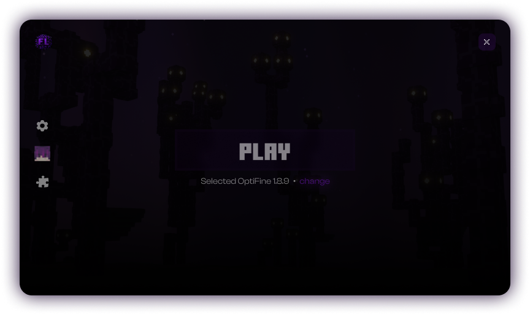

<h1 align="center"> 💫 SolarLauncher</h1>

An open-source and lightweight launcher for Minecraft 
<em>Flexberry Launcher is <b align="center">under development</b>, join to <a href="https://discord.gg/dbVPH8KYP2">
Discord server
</a> and check the progress</em>
  

<h1>✨ Features</h1>

* 🔒 Easy and secure account management
  * Add multiple Microsoft accounts and switch between them easily.
  * Does not stores your data.
  * Supports offline mode. `soon`
* 📂 Version control system
  * Flexberry Launcher keeps itself up-to-date all the time.
* ⚙️ Useful settings to manage launcher
  * More settings will be added `soon`
* ☕ Automatic Java installer
  * Installs Java for Minecraft versions that needs different versions of Java.
* 🎨 Built in skin library to select from `soon`
* 🏗️ Mod manager to install new mods and manage installed ones  `soon`
